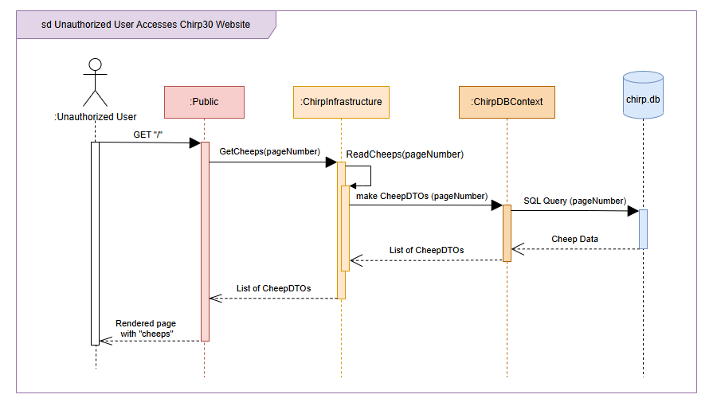
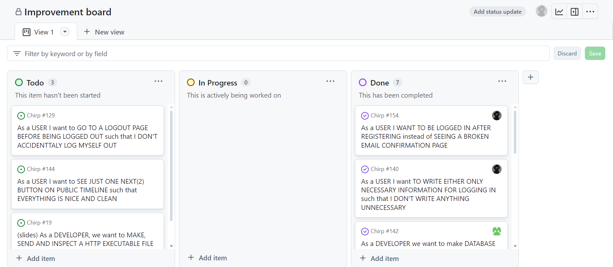
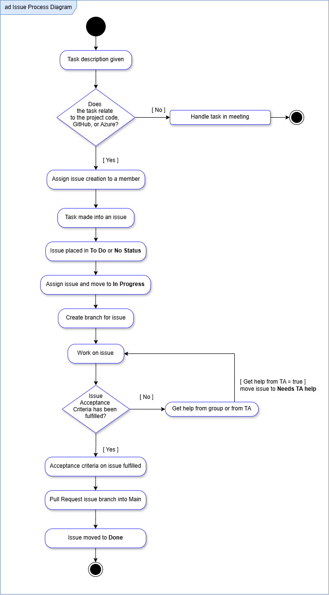

# Sequence of functionality/calls through Chirp!

## Sequence Diagram of Unauthorized User

Below is a diagram showing the sequence of steps for an unauthorized user[^user status] attempting to access the root web page, Public Timeline on the chirp30 application (https://bdsagroup30chirpremotedb.azurewebsites.net/). 

The diagram has 5 lifelines, Unauthorized User, PublicTimeline, ChirpInfrastructure, ChirpDBContext, and chirp.db. The third one, ChirpInfrastructure, represents classes contained in this layer of the implemented Onion Architecture, specifically the two classes `CheepService.cs` and `CheepRepository.cs`. Note that while `ChirpDBContext.cs` is also a part of this onion layer, eventhough it has been made explicit here for the purpose of showing how this is the class actually responsible for accessing the database.

Description of *Sequence Diagram of Unathorized User* in case of technical issues or otherwise:

The first action made by the unauthorized user is an HTTP `GET` request to the root endpoint `"/"`, which is received by the PublicTimeline object (containing the two classes `PublicTimeline.cshtml` and `PublicTimeline.cshtml.cs`). This is followed with a `GetCheeps(pageNumber)` call to `ChirpInfrastructure` to get the neccessary cheeps to display on the Public Timeline. The integer variable `pageNumber` is transported all the way to `ChirpDBContext` which uses it to ensure only the correct 32 cheeps are saved and returned. After `ChirpInfrastructure` has received the `GetCheeps(pageNumber)` call, it calls a method on itself `ReadCheeps(pageNumber)` from which the call to make Cheep Data Transferable Objects (CheepDTOs) in `ChirpDBContext` begins. Finally, `ChirpDBContext` accesses `chirp.db` to get the relevant data before it is all sent back through the objects. 

[^user status]: footnote explaining the interpretation of "authorized" in this context.

## Sequence Diagram of Authorized User:
This second diagram is more detailed than the first, both in which lifelines are included and which functionalities are explored.

---
*From README_REPORT.md week 12*

With a UML sequence diagram, illustrate the flow of messages and data through your Chirp! application. Start with an HTTP request that is send by an unauthorized user to the root endpoint of your application and end with the completely rendered web-page that is returned to the user.

Make sure that your illustration is complete. That is, likely for many of you there will be different kinds of "calls" and responses. Some HTTP calls and responses, some calls and responses in C# and likely some more. (Note the previous sentence is vague on purpose. I want that you create a complete illustration.)

# Team work

## Current Status (Rename this to a better title)

Two project boards were made for group 30's `Chirp!` repository. One containing issues made from official task descriptions titled `ITU-BDSA2024-GROUP30 Chirp`, and a second called `Improvement board` for all the things that needed improving, fixing, or general nice to implement, but which weren't part of any given task description. 

### Official Task Project Board:

Insert 1st project board picture here: 

XX issues have been completed, while N issues are still unresolved. Majority of these unresolved issues are related to testing. 

### Board for Improvements

Below is a screenshot of the second project board[^improvementDate]. It contains 9 issues [^tenth], 4 of which are marked as done while the last 5 are either in the **No Status** or **Todo** column. The low number of issues is due to the project board's comparatively late creation from around session 13. It was created to give the group easy access to what non-official task elements needed improvements, fixing or other work. As such, issues on this board are all prioritised as nice-to-have, while the other project board is prioritised as need-to-have.

[^improvementDate]: Taken on december 12th 2024.

[^tenth]: The tenth element on the board is a pull request.

## Process of creating issues 

The process of creating issues, working on them until completion and merging them into the code on main, is shown in the diagram below. Following the diagram is a description on the set up of issues. 

Issues on both project boards follow the same *User Story* setup for titleing and content description. All issues made from official task descriptions were additionally named after which session and task number they already had. For example, the task 1.b) "Add Pagination of Cheeps" from session 5, would be written as first the session number, then the task number and letter, and optionally a third number depending on how many issues will be made from the one task. So the issue title would start with **(5.1.b.1)** and then followed by a short user story title. 

Below is the guideline we used for writing titles: (excluding the numbering system) 

    As a <ROLE>, I want <GOAL> [so that <BENEFIT>]

Issues contain a list of acceptance criteria and depending on the original task, more sections with neccessary information such as "advice", "hints", or "pre-requisite" would be included.

(Notes: should the section below the diagram be moved above it instead?)

---

*From README_REPORT.md week 12*

Show a screenshot of your project board right before hand-in. Briefly describe which tasks are still unresolved, i.e., which features are missing from your applications or which functionality is incomplete.
