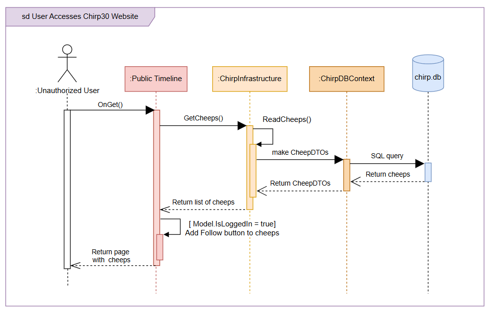

# Sequence of functionality/calls through Chirp!

Unauthorized user:

The diagram belows shows an unauthorized user entering our root web page, Public Timeline on the chirp application.

Authorized user:

---
*From README_REPORT.md week 12*

With a UML sequence diagram, illustrate the flow of messages and data through your Chirp! application. Start with an HTTP request that is send by an unauthorized user to the root endpoint of your application and end with the completely rendered web-page that is returned to the user.

Make sure that your illustration is complete. That is, likely for many of you there will be different kinds of "calls" and responses. Some HTTP calls and responses, some calls and responses in C# and likely some more. (Note the previous sentence is vague on purpose. I want that you create a complete illustration.)

# Team work

## Current Status (Rename this to a better title)

XX issues have been completed, while N issues are still unresolved. Majority of these unresolved issues are related to testing. 

Insert picture here: 

## Process of creating issues 

Diagram in process. Once it is done it will be added here and explananing

---

*From README_REPORT.md week 12*

Show a screenshot of your project board right before hand-in. Briefly describe which tasks are still unresolved, i.e., which features are missing from your applications or which functionality is incomplete.

Briefly describe and illustrate the flow of activities that happen from the new creation of an issue (task description), over development, etc. until a feature is finally merged into the main branch of your repository.

What to get through/include:
- User story setup
- Two project boards
- Issues created individually 
- Issues created one person whole week (most times)
- Show leftover issues
- Walkthrough from create issue till implemented feature on main.