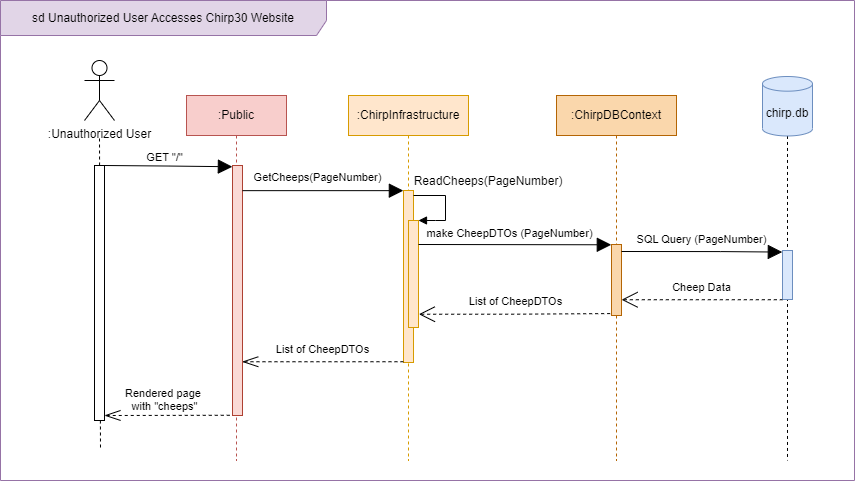
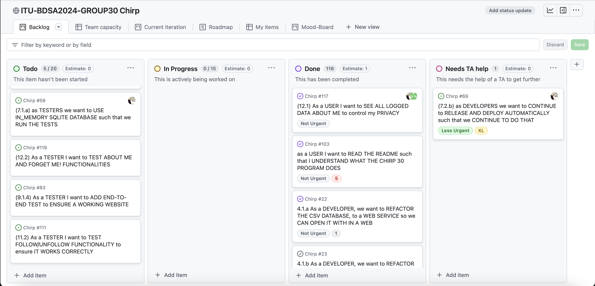

# Sequence of functionality/calls through Chirp!

## Sequence Diagram of Unauthorized User

Below is a diagram showing the sequence of steps for an unauthorized user[^userStatus] attempting to access the root web page, Public Timeline on the chirp30 application (https://bdsagroup30chirpremotedb.azurewebsites.net/). 

The diagram has 5 lifelines, Unauthorized User, PublicTimeline, ChirpInfrastructure, ChirpDBContext, and chirp.db. The third one, ChirpInfrastructure, represents classes contained in this layer of the implemented Onion Architecture, specifically the two classes `CheepService.cs` and `CheepRepository.cs`. Note that while `ChirpDBContext.cs` is also a part of this onion layer, eventhough it has been made explicit here for the purpose of showing how this is the class actually responsible for accessing the database.

Description of *Sequence Diagram of Unathorized User* in case of technical issues or otherwise:

The first action made by the unauthorized user is an HTTP `GET` request to the root endpoint `"/"`, which is received by the PublicTimeline object (containing the two classes `PublicTimeline.cshtml` and `PublicTimeline.cshtml.cs`). This is followed with a `GetCheeps(pageNumber)` call to `ChirpInfrastructure` to get the necessary cheeps to display on the Public Timeline. The integer variable `pageNumber` is transported all the way to `ChirpDBContext` which uses it to ensure only the correct 32 cheeps are saved and returned. After `ChirpInfrastructure` has received the `GetCheeps(pageNumber)` call, it calls a method on itself `ReadCheeps(pageNumber)` from which the call to make Cheep Data Transferable Objects (CheepDTOs) in `ChirpDBContext` begins. Finally, `ChirpDBContext` accesses `chirp.db` to get the relevant data before it is all sent back through the objects. 

[^userStatus]: The report task description used the word "unauthorized" to likely describe "a user who is not logged in (has not received extra authorization)", even though it could also be interpreted as "a user who does not have the authority to access the webpage (no authorization at all)". While the last interpretation could also be a fun diagram to look at, we went with the first interpretation as that is what the course material (Andrew Lock, *ASP.NET Core in Action* (Shelter Island: Manning Publications Co. 2023)) seem to suggest. 

## Sequence Diagram of Authorized User:
The second diagram focuses on an changes in the program when a user is authenticated (logged in). The total number of lifelines remains the same, although "ChirpDBContext" lifeline has been absorbed into "ChirpInfrastructure" lifeline and the "Public" lifeline has been split into two, namely *Public.cshtml* and *Public.cshtml.cs*. Note that the latter object is shown to occur first, the two are called simultaneously through the act of a third party object not shown here. The have been split to start separately as the specific calls vary (Note: I know this is not a good "argument" at all, but I have reached my limit of thinking, so I am very open to suggestions. Also I have no direct proof they happen simultaneously, only that I looked hard to try and figure out which one was called first without luck).

# Team work

## Project Boards Overview:

Two project boards were made for group 30's `Chirp!` repository. One containing issues made from official task descriptions titled `ITU-BDSA2024-GROUP30 Chirp`, and a second called `Improvement board` for all the things that needed improving, fixing, or general nice to implement, but which weren't part of any given task description. 

### Official Task Project Board:

As shown in the screenshot below[^projectBoardDate], a total of 110 issues and pull requests have been completed and placed in the **Done** column. That leaves a total of 10 issues that have not been completed. 8 of which have not been started and sits in the two columns **No Status** and **Todo**. The final 2 issues are distributed equally in **In Progress** and in **Needs TA help**. The latter category was created to put away a difficult issue and work on other issues, until it was possible to get a TAs help with the stumped one.

Among the issues which have not been started, are two missing features. The "About Me" page containing all logged information of the logged in user, and the "Forget Me" button which deletes the registered user from the database and from other users' follow lists. 

The unresolved issues span from week 7 up till week 12, excluding the weeks 8 and 10. Half of the non-started issues are related to testing, with one issue being testing the "Forget Me" feature which was not implemented. 
(Note: help rewrite this section to 'flow' better and such)

[^projectBoardDate]: Taken on December 15th 2024.

#### Wild Style - Hate-Meter and Love-Meter

A final misisng feature which has no related issues whatsoever, is the wild style feature from session 13. Below is a mock-up showing an inclusion of a "Love-Meter" and a "Hate-Meter" where logged in users can click either the whole heart icon or the broken heart icon to give *love* or *hate* respectively to a cheep. There would be no limit as to how much *love* or *hate* a single user can give per cheep. A bonus feature would be when the "Hate-Meter" is fully filled and the cheeps author has their account deleted from the application. The user would be free to re-register an account, but all of their follows and cheeps would be gone.

### Board for Improvements

Below is a screenshot of the second project board[^improvementDate]. It contains 9 issues [^tenth], 4 of which are marked as done while the last 5 are either in the **No Status** or **Todo** column. The low number of issues is due to the project board's comparatively late creation from around session 13. It was created to give the group easy access to what non-official task elements needed improvements, fixing or other work. As such, issues on this board are all prioritised as "nice-to-have", while the other project board is prioritised as "need-to-have".

[^improvementDate]: Taken on December 12th 2024.

[^tenth]: The tenth element on the board is a pull request.

## Process of Creating Issues 

The process of creating issues, working on them until completion and merging them into the code on main, is shown in the diagram below. Following the diagram is a description on the set up of issues. 

Issues on both project boards follow the same *User Story* setup for titleing and content description. All issues made from official task descriptions were additionally named after which session and task number they already had. For example, the task 1.b) "Add Pagination of Cheeps" from session 5, would be written as first the session number, then the task number and letter, and optionally a third number depending on how many issues will be made from the one task. So the issue title would start with **(5.1.b.1)** and then followed by a short user story title. 

Below is the guideline we used for writing titles: (excluding the numbering system) 

    As a <ROLE>, I want <GOAL> [so that <BENEFIT>]

Issues contain a list of acceptance criteria and depending on the original task, more sections with neccessary information such as "advice", "hints", or "pre-requisite" would be included.