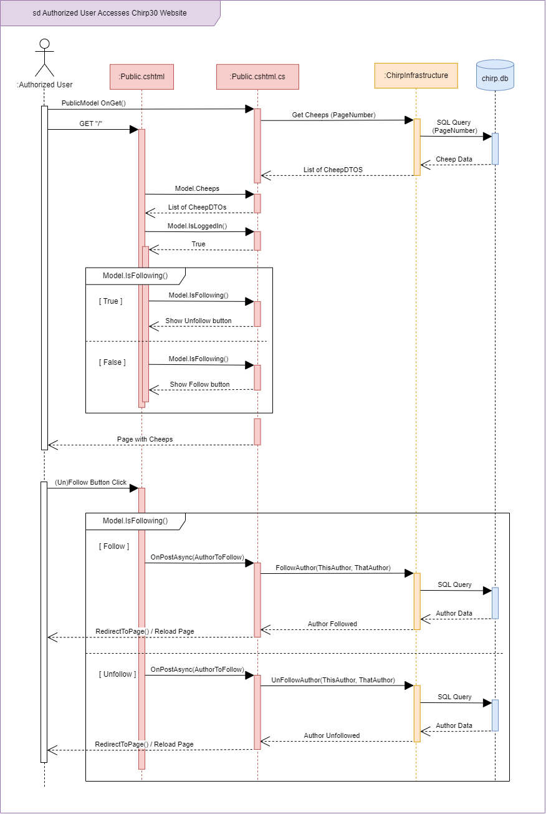

# Sequence of functionality/calls through Chirp!

## Sequence Diagram of Unauthorized User

Below is a diagram showing the sequence of steps for an unauthorized user[^userStatus] attempting to access the root web page, *Public Timeline* on the Chirp30 application[^chirpLink]. 

The diagram below has five lifelines, *Unauthorized User*, *Public*[^publicTimeline], *ChirpInfrastructure*, *ChirpDBContext*, and `chirp.db`. The third one, *ChirpInfrastructure*, represents all classes contained in this layer of the implemented Onion Architecture, specifically the two classes `CheepService.cs` and `CheepRepository.cs`. Note that while `ChirpDBContext.cs` is also a part of this onion layer, eventhough it has been made explicit here for the purpose of showing how this is the class actually responsible for accessing the database.

[^chirpLink]: https://bdsagroup30chirpremotedb.azurewebsites.net/

[^publicTimeline]: The *:Public* object is both a combination of the two classes `Public.cshtml` and `Public.cshtml.cs` and represents the overall attempt to access the *Public Timeline*.

Description of *Sequence Diagram of Unauthorized User* in case of technical issues or otherwise:

The first action made by the unauthorized user is an HTTP `GET` request to the root endpoint `"/"`, which is received by the *Public* object (containing the two classes `Public.cshtml` and `Public.cshtml.cs`). This is followed with a `GetCheeps(PageNumber)` call to *ChirpInfrastructure* to get the necessary Cheeps to display on the Public Timeline. The integer variable `PageNumber` is transported all the way to *ChirpDBContext* which uses it to ensure only the correct 32 Cheeps are saved and returned. After *ChirpInfrastructure* has received the `GetCheeps(PageNumber)` call, it calls a method on itself `ReadCheeps(PageNumber)` from which the call to make Cheep Data Transferable Objects (CheepDTOs) in `ChirpDBContext` begins. Finally, *ChirpDBContext* accesses `chirp.db` to get the relevant data before it is all sent back through the objects. 

[^userStatus]: The report task description used the word "unauthorized" to likely describe "a user who is not logged in (has not received extra authorization)", even though it could also be interpreted as "a user who does not have the authority to access the webpage (no authorization at all)". While the last interpretation could also be a fun diagram to look at, we went with the first interpretation as that is what the course material (Andrew Lock, *ASP.NET Core in Action* (Shelter Island: Manning Publications Co. 2023)) seem to suggest. 

## Sequence Diagram of Authorized User:
The second diagram focuses on which changes occur in the program when a user has been authenticated (logged in). The total number of lifelines remains the same, although the *ChirpDBContext* lifeline has been absorbed into *ChirpInfrastructure* lifeline and the *Public* lifeline has been split into two, namely `Public.cshtml` and `Public.cshtml.cs`. Note that although the latter object is shown to occur first, the two objects are started concurrently. 

Description of *Sequence Diagram of Authorized User* in case of technical issues or otherwise:

The first action made by the *Authorized User* is an HTTP request to the website, which starts two calls. An `OnGet()` call to the *Public.cshtml.cs* lifeline and a `GET` request received by the *Public.cshtml* lifeline. The first call, `OnGet()` starts a process matching the process shown in the *Sequence Diagram of Unauthorized User*. After *Public.cshtml.cs* receives the list of `CheepDTOs` from *ChirpInfrastructure*, it is given to *Public.cshtml* who then checks if the *User* is logged in or not through the model in *Public.cshtml.cs*. If the *User* is logged in, which is the case for this *Authorized User*, an alternative box is placed, which shows the two cases of if a *User* is following the owner of a cheep or not. If the *Authorized User* is not following the other user, then the *Follow* button will be shown, otherwise the *Unfollow* button will be shown. A similar alternative box appears for when the *Follow*/*Unfollow* button is clicked.

\pagebreak

# Team work

## Project Boards Overview:

Two project boards were made for group 30's `Chirp!` repository. One containing issues made from official task descriptions titled `ITU-BDSA2024-GROUP30 Chirp`, and a second called `Improvement board` for all the things that needed improving, fixing, or general nice to implement, but which weren't part of any given task description. 

### Official Task Project Board

As shown in the screenshot below[^projectBoardDate], a total of 116 issues and pull requests have been completed and placed in the **Done** column. That leaves a total of 6 issues that have not been completed, 5 of which are not started and waiting in the **Todo** column to be assigned. The last issue is in the **Needs TA help**. This extra category was created to temporarily put away difficult issues in favour of working on easier issues, until it would be possible to get a TAs help with the stumped one.

Overall, only one feature is left un-implemented. Session 13's "Wild Style" never got any issues on GitHub and is further described in the following section. The issues placed in **Todo** are all related to testing, orignating from session 7 up till session 12 (excluding the weeks 8 and 10).

[^projectBoardDate]: Taken on December 17th 2024.

#### Wild Style Feature - Hate-Meter and Love-Meter

A final missing feature with no related issues whatsoever, is the wild style feature from session 13. Below is a mock-up showing a possible inclusion of a "Love-Meter" and a "Hate-Meter" where logged in users can click either the whole heart icon or the broken heart icon to give *love* or *hate* respectively to a Cheep. There would be no limit on how much *love* or *hate* a single user can give per Cheep. A bonus feature would be that when the "Hate-Meter" reaches maximum capacity, the Cheep's author has their account deleted from the application. The user would be free to re-register an account, but all of their follows and Cheeps would be gone.

### Board for Improvements

Below is a screenshot of the second project board[^improvementDate]. It contains 10 issues, 7 of which are marked as done while the last 3 are either in the **Todo** column. The low number of issues is due to the project board's comparatively late creation from around session 13. It was created to give the group easy access to what non-official task elements needed improvements, fixing or other work. As such, issues on this board are all prioritised as "nice-to-have", while the other project board is prioritised as "need-to-have".

[^improvementDate]: Taken on December 17th 2024.

## Process of Creating Issues 

The process of creating issues, working on them until completion and merging them into the code on main, is shown in the diagram below. Following the diagram is a description on the set up of issues. 

Issues on both project boards follow the same *User Story* setup for titleing and content description. All issues made from official task descriptions were additionally named after which session and task number they already had. For example, the task 1.b) "Add Pagination of Cheeps" from session 5, would be written as first the session number, then the task number and letter, and optionally a third number depending on how many issues will be made from the one task. So the issue title would start with **(5.1.b.1)** and then followed by a short user story title. 

Below is the guideline we used for writing titles: (excluding the numbering system) 

    As a <ROLE>, I want <GOAL> [so that <BENEFIT>]

Issues contain a list of acceptance criteria and depending on the original task, more sections with neccessary information such as "advice", "hints", or "pre-requisite" would be included.
