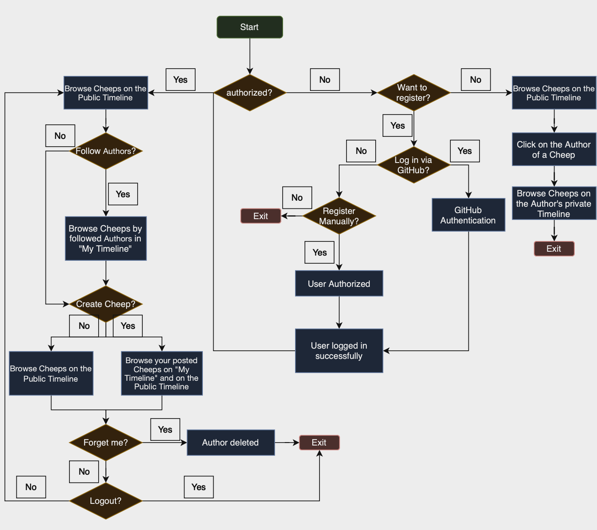

User activities

Illustrate typical scenarios of a user journey through your Chirp! application. That is, start illustrating the first page that is presented to a non-authorized user, illustrate what a non-authorized user can do with your Chirp! application, and finally illustrate what a user can do after authentication.

Make sure that the illustrations are in line with the actual behavior of your application.
# User Activities
For unauthenticated users, common actions could include browsing cheeps on the public timeline or viewing detailed information about an author. This might include the author's posted cheeps, total number of cheeps, and other relevant details, accessible via the author's private timeline. The corresponding user journey for this Chirp! use case is illustrated in the following User Flow Diagram:

LLMs, ChatGPT, CoPilot, and others

State which LLM(s) were used during development of your project. In case you were not using any, just state so. In case you were using an LLM to support your development, briefly describe when and how it was applied. Reflect in writing to which degree the responses of the LLM were helpful. Discuss briefly if application of LLMs sped up your development or if the contrary was the case.

Maybe add short discription of Gemini and ChatGPT. AND conclusion.

# Usage of Large Language Models
During the development of our project, we utilised large language models (LLMs) to varied extents to assist different aspects of our work. 

## Applications of ChatGPT and Gemini
We worked with *ChatGPT* and *Gemini* the same way, just depended on the individual person in the groups preferance.

The LLMs were mainly used to resolve unclear errors, especially when other resouces like Google searches did not yeild sufficient answers. Framing questions such as "I expect to get (...), but I got (...). Why?" let us receive targeted and actionable feedback. It was also instrumental in explaining why certain pieces of code behaved in unexpected ways and clarifying frameworks or technoglogies we could not directly inspect, such as Razor pages. Along with connecting the dots regarding the theory and in practice.

ChatGPT and Gemini also helped us better understand error messages and validate our assumptions about problems. For example, we often prompted it with questions like “Can you explain…” or “I think my problem is… why?” These interactions often provided clearer explanations that improved our understanding of the issues at hand.

## Effectiveness
The used LLMs proved to be helpful for the majority of tasks we encountered. It was particularly effective for troubleshooting and error resolution, often serving as a substitute for consulting teaching assistants (when they were unavailable) or spending hours researching. The ability to quickly identify issues and gain insights into complex concepts sped up our development process.

However, there were some limitations. Responses could occasionally be overly complex or repetitive, particularly in specific areas like EF Core, where the tools sometimes struggled to provide unique or actionable suggestions. Despite these occasional inefficiencies, ChatGPT and Gemini were overall more helpful than not, acting as a useful sparring partner when tackling challenging problems. 

## Impact on Development Workflow
The use of LLMs accelerated our development process by enabling faster understanding of problems and solutions. It allowed us to spend less time searching for answers and more time implementing and refining our code. In areas where traditional resources were insufficient or time-consuming, ChatGPT and Gemini filled the gap. While there were moments where its responses fell short, its overall impact was positive, contributing to our efficiency and learning throughout the project.      