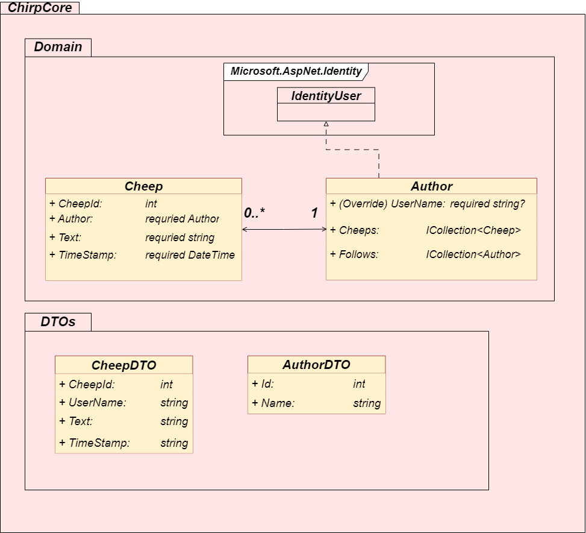
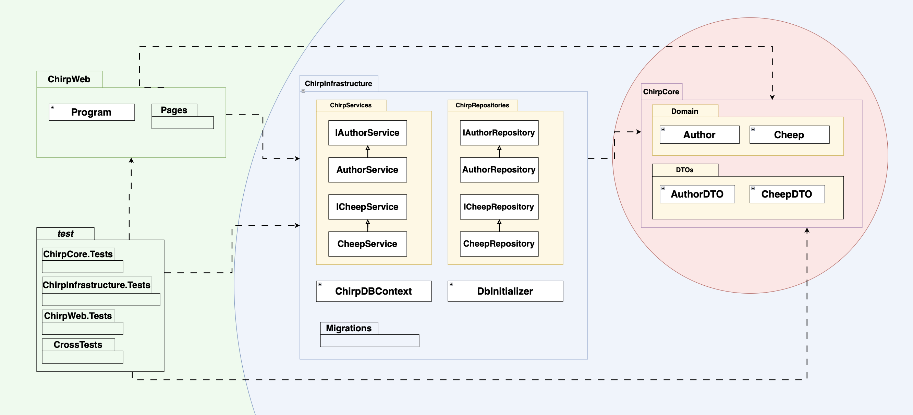
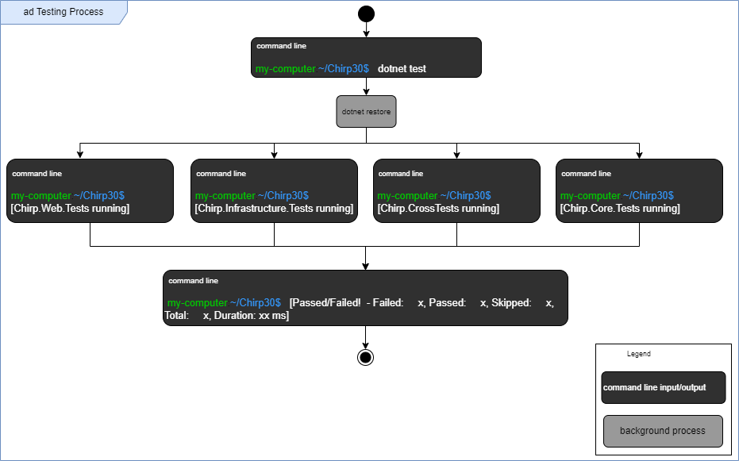
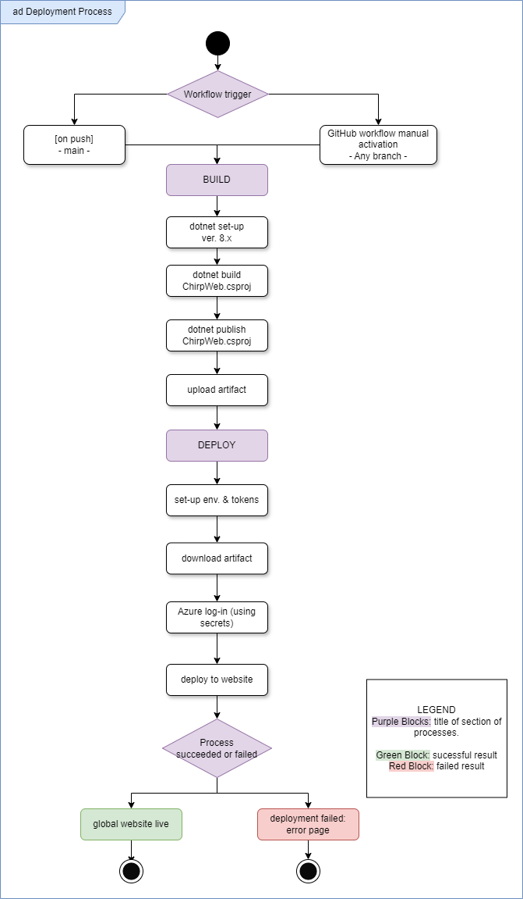

Analysis, Design and Software Architecture (Autumn 2024)
Course code: BSANDSA1KU

\pagebreak

# Introduction
This is the official project report for the _Chirp!_ application developed as part of the Analysis, Design, and Software Architecture course at ITU in 2024. The report provides an overview of the project's design, architecture, development process, and ethical considerations.

The primary goal of this report is to document the technical and collaborative aspect of the project. The application is an X-like[^whatisx] application, that share a lot of the same functionalities. In order to create the application a number of different technologies were used, e.g. ASP.NET Core and SQLite.

 [^whatisx]:'Reminicent of the website 'X', previously known as Twitter'

# Design and Architecture of _Chirp!_

## Domain model

Figure 1 illustrates our domain model. 

ChirpCore contains the core entities, Author and Cheep. These reside in the folder Domain. We have Data Transfer Objects (DTOs) for Authors called AuthorDTO and for Cheeps called CheepDTO. These reside in the folder DTOs.

\pagebreak

## Architecture — In the small

The figure above illustrates the organization of our code base. 

The architecture of our code is divided into three layers. The first layer holds ChirpCore. This folder contains our domain model entities and DTOs. The second layer contains ChirpInfrastructure, which contains our service classes and our repository classes, separated into ChirpServices and ChirpRepositories. ChirpInfrastructure also contains the classes DBInitializer and ChirpDBContext as well as our migrations folder. 
The final layer consists of the ChirpWeb folder, which contains the program class and the RazorPages,  and our test directory. 

## Architecture of deployed application

The Chirp! Application is hosted on Azure. The Client device communicates with  the web-server through HTTPs. 

\pagebreak

## User activities

For unauthenticated users, common actions could include browsing Cheeps on the public timeline or viewing a specific Author's timeline, which shows only Cheeps made by that Author. The user journey for this _Chirp!_ use case is illustrated in the following User Flow diagram:

\pagebreak

## Sequence of functionality/calls trough _Chirp!_

### Sequence Diagram of Unauthorized User

Below is a diagram showing the sequence of steps for an unauthorized user[^userStatus] attempting to access the root web page, *Public Timeline* on the Chirp30 application[^chirpLink]. 

The diagram below has five lifelines, *Unauthorized User*, *Public*[^publicTimeline], *ChirpInfrastructure*, *ChirpDBContext*, and `chirp.db`. The third one, *ChirpInfrastructure*, represents all classes contained in this layer of the implemented Onion Architecture, specifically the two classes `CheepService.cs` and `CheepRepository.cs`. Note that while `ChirpDBContext.cs` is also a part of this onion layer, eventhough it has been made explicit here for the purpose of showing how this is the class actually responsible for accessing the database.

[^chirpLink]: https://bdsagroup30chirpremotedb.azurewebsites.net/

[^publicTimeline]: The *:Public* object is both a combination of the two classes `Public.cshtml` and `Public.cshtml.cs` and represents the overall attempt to access the *Public Timeline*.

Description of *Sequence Diagram of Unauthorized User* in case of technical issues or otherwise:

The first action made by the unauthorized user is an HTTP `GET` request to the root endpoint `"/"`, which is received by the *Public* object (containing the two classes `Public.cshtml` and `Public.cshtml.cs`). This is followed with a `GetCheeps(PageNumber)` call to *ChirpInfrastructure* to get the necessary Cheeps to display on the Public Timeline. The integer variable `PageNumber` is transported all the way to *ChirpDBContext* which uses it to ensure only the correct 32 Cheeps are saved and returned. After *ChirpInfrastructure* has received the `GetCheeps(PageNumber)` call, it calls a method on itself `ReadCheeps(PageNumber)` from which the call to make Cheep Data Transferable Objects (CheepDTOs) in `ChirpDBContext` begins. Finally, *ChirpDBContext* accesses `chirp.db` to get the relevant data before it is all sent back through the objects. 

[^userStatus]: The report task description used the word "unauthorized" to likely describe "a user who is not logged in (has not received extra authorization)", even though it could also be interpreted as "a user who does not have the authority to access the webpage (no authorization at all)". While the last interpretation could also be a fun diagram to look at, we went with the first interpretation as that is what the course material (Andrew Lock, *ASP.NET Core in Action* (Shelter Island: Manning Publications Co. 2023)) seem to suggest. 

### Sequence Diagram of Authorized User:
The second diagram focuses on which changes occur in the program when a user has been authenticated (logged in). The total number of lifelines remains the same, although the *ChirpDBContext* lifeline has been absorbed into *ChirpInfrastructure* lifeline and the *Public* lifeline has been split into two, namely `Public.cshtml` and `Public.cshtml.cs`. Note that although the latter object is shown to occur first, the two objects are started concurrently. 

Description of *Sequence Diagram of Authorized User* in case of technical issues or otherwise:

The first action made by the *Authorized User* is an HTTP request to the website, which starts two calls. An `OnGet()` call to the *Public.cshtml.cs* lifeline and a `GET` request received by the *Public.cshtml* lifeline. The first call, `OnGet()` starts a process matching the process shown in the *Sequence Diagram of Unauthorized User*. After *Public.cshtml.cs* receives the list of `CheepDTOs` from *ChirpInfrastructure*, it is given to *Public.cshtml* who then checks if the *User* is logged in or not through the model in *Public.cshtml.cs*. If the *User* is logged in, which is the case for this *Authorized User*, an alternative box is placed, which shows the two cases of if a *User* is following the owner of a cheep or not. If the *Authorized User* is not following the other user, then the *Follow* button will be shown, otherwise the *Unfollow* button will be shown. A similar alternative box appears for when the *Follow*/*Unfollow* button is clicked.

\pagebreak

# Process

## Build, test, release, and deployment

### Build
Figure 7 illustrates the build process. By running `dotnet build` in the terminal, an implicit run of `dotnet restore` is triggered. After restoring, .dll files are created for each .csproj file. When all .dll files are created, the terminal will output a `Build Successful!` message.

\pagebreak

### Test

Figure 8 details how our program is tested. After inputting `dotnet test` in the terminal from the source directory, `dotnet restore` will run. Hereafter, all test files will run, and the terminal will output `Success`/`Failure` states for each testing directory. Alternative methods to testing are described in the "How to run test suite locally" section.

### Release

Figure 9 is an illustration of our release process. A release can be triggered on push from any branch, but requires a tag that matches the pattern '*.*.*', e.g. 1.0.0.
Upon pushing a tag, the release workflow will activate and create three releases for each of the following operating systems: Windows, MacOS and Linux. Depending on whether the sub-release targets Windows or one of the other two operating systems, the executable file will be named Chirp.exe or Chirp respectively.
Our release is created from the `ChirpWeb.csproj` file, zipped and uploaded to GitHub where anyone can download them[^releasenote]

\pagebreak

### Deployment

Figure 10 shows how our program deploys from the GitHub workflow *Executable Release of Chirp*. The workflow is always triggered by a push to main, ensuring automatic deployment. For more control, we also have a workflow trigger on GitHub, where we can deploy from any branch.
This workflow takes care of building and publishing the project, as well as sending artifacts and secrets to the Azure host. When the workflow is finished, the website is updated.

\pagebreak

## Team work

### Project Boards Overview

Two project boards were made for group 30's `Chirp!` repository. One containing issues made from official task descriptions titled `ITU-BDSA2024-GROUP30 Chirp`, and a second called `Improvement board` for all the things that needed improving, fixing, or general nice to implement, but which weren't part of any given task description. 

### Official Task Project Board

As shown in the screenshot below[^projectBoardDate], a total of 116 issues and pull requests have been completed and placed in the **Done** column. That leaves a total of 6 issues that have not been completed, 5 of which are not started and waiting in the **Todo** column to be assigned. The last issue is in the **Needs TA help**. This extra category was created to temporarily put away difficult issues in favour of working on easier issues, until it would be possible to get a TAs help with the stumped one.

Overall, only one feature is left un-implemented. Session 13's "Wild Style" never got any issues on GitHub and is further described in the following section. The issues placed in **Todo** are all related to testing, orignating from session 7 up till session 12 (excluding the weeks 8 and 10).

[^projectBoardDate]: Taken on December 17th 2024.

### Wild Style Feature - Hate-Meter and Love-Meter

A final missing feature with no related issues whatsoever, is the wild style feature from session 13. Below is a mock-up showing a possible inclusion of a "Love-Meter" and a "Hate-Meter" where logged in users can click either the whole heart icon or the broken heart icon to give *love* or *hate* respectively to a Cheep. There would be no limit on how much *love* or *hate* a single user can give per Cheep. A bonus feature would be that when the "Hate-Meter" reaches maximum capacity, the Cheep's author has their account deleted from the application. The user would be free to re-register an account, but all of their follows and Cheeps would be gone.

### Board for Improvements

Below is a screenshot of the second project board[^improvementDate]. It contains 10 issues, 7 of which are marked as done while the last 3 are either in the **Todo** column. The low number of issues is due to the project board's comparatively late creation from around session 13. It was created to give the group easy access to what non-official task elements needed improvements, fixing or other work. As such, issues on this board are all prioritised as "nice-to-have", while the other project board is prioritised as "need-to-have".

\pagebreak

[^improvementDate]: Taken on December 17th 2024.

### Process of Creating Issues 

The process of creating issues, working on them until completion and merging them into the code on main, is shown in the diagram below. Following the diagram is a description on the set up of issues. 

Issues on both project boards follow the same *User Story* setup for titleing and content description. All issues made from official task descriptions were additionally named after which session and task number they already had. For example, the task 1.b) "Add Pagination of Cheeps" from session 5, would be written as first the session number, then the task number and letter, and optionally a third number depending on how many issues will be made from the one task. So the issue title would start with **(5.1.b.1)** and then followed by a short user story title. 

Below is the guideline we used for writing titles: (excluding the numbering system) 

    As a <ROLE>, I want <GOAL> [so that <BENEFIT>]

Issues contain a list of acceptance criteria and depending on the original task, more sections with neccessary information such as "advice", "hints", or "pre-requisite" would be included.

\pagebreak

## How to make _Chirp!_ work locally

1. Clone Project by running the following command from your terminal

    `git clone https://github.com/ITU-BDSA2024-GROUP30/Chirp.git`

2. Navigate to the project directory (Chirp/src/ChirpWeb)

3. From the ChirpWeb project folder, run the following commands in the terminal

    `dotnet user-secrets set "authentication_github_clientId" "Ov23li1DOiXTMCfh0Wxn"`

    `dotnet user-secrets set "authentication_github_clientSecret" "6afb7425e1d9b80b84c43372a2f4c5e35506b0f"`
	

4. Run the program by using the following command in the terminal (Still from ChirpWeb). 

    `dotnet run`

5. After running the command, you should see output indicating that the app is running (`Now listening on: http://localhost:5273`).    Open your browser and go to the URL provided in the terminal (e.g., `http://localhost:5273`) to access the application.

 

#### Notes 

- We are aware that we should not include our ClientID and ClientSecret like this in the repository, but it is needed for someone to run the program locally. 

- While running our program locally, there is a problem with OAuth and Github register/login when using the Safari browser. This is not the case for Chrome or Firefox. Safari does not cause problems for our global Chirp app. 

\pagebreak

## How to run test suite locally

**Assuming the repository has been cloned:**

- Open a command line tool
- Navigate to the root directory (`/Chirp`) OR a specific test directory (e.g `/Chirp/test/Chirp.ChirpCore.Tests`)
- Enter `dotnet test` in the command line and press enter
- All tests will now run - If you're in a specific test directory, only tests for this directory run.

**Without cloning the repository:**

- Navigate to the GitHub website for the Chirp30 repository
- Press 'Actions' in the upper toolbar
- Choose workflow 'Build and Test .NET' in the list of workflows to the left
- Choose 'Run workflow' twice - let branch remain as 'main'
- Observe the workflow where each test directory has its own job, which states whether the tests have passed and failed.

In `Chirp.ChirpCore.Tests` we have unit tests for testing the ChirpCore part of the program, by creating entities of our domain model types and testing whether they can be created correctly, as well as test that Cheeps and Authors can be related to each other.
We have a test in `Chirp.ChirpInfrastructure.Tests` that is independent of the program code, and should ALWAYS pass - it is our canary in the coal mine[^CanaryFootnote]. If this test fails, our test suite is not functioning.
Up until the final few weeks we had API tests in `Chirp.ChirpWeb.Tests`, which tested if we got the expected outputs from both the public and private timelines. These tests became unusable and were removed when we changed our database to run using an environment variable.

\pagebreak

# Ethics

## License

>The MIT License (MIT)
>
>Copyright (c) 2024 ITU-BDSA2024-GROUP30
>
>Permission is hereby granted, free of charge, to any person obtaining a copy of this software and associated documentation files (the "Software"), to deal in the Software without restriction, including without limitation the rights to use, copy, modify, merge, publish, distribute, sublicense, and/or sell copies of the Software, and to permit persons to whom the Software is furnished to do so, subject to the following conditions:
>
>The above copyright notice and this permission notice shall be included in all copies or substantial portions of the Software.
>
>THE SOFTWARE IS PROVIDED "AS IS", WITHOUT WARRANTY OF ANY KIND, EXPRESS OR IMPLIED, INCLUDING BUT NOT LIMITED TO THE WARRANTIES OF MERCHANTABILITY, FITNESS FOR A PARTICULAR PURPOSE AND NONINFRINGEMENT. IN NO EVENT SHALL THE AUTHORS OR COPYRIGHT HOLDERS BE LIABLE FOR ANY CLAIM, DAMAGES OR OTHER LIABILITY, WHETHER IN AN ACTION OF CONTRACT, TORT OR OTHERWISE, ARISING FROM, OUT OF OR IN CONNECTION WITH THE SOFTWARE OR THE USE OR OTHER DEALINGS IN THE SOFTWARE.

> *See our License.MD file in the root of our directory for the associated Microsoft licenses.*

We have used packages from Microsoft in our program (.NET, EFCore), from which all fall under the MIT License. As the MIT License is GPL compatible[^UniOfPitts], it means we could have chosen a different Open Source license for our project[^LicenseCompat]. However this would have been more intricate, as the different license we would choose would still need to be compatible with the MIT license.
Therefore we too have decided to use the MIT license, such that all code in the program is under the same license.

\pagebreak

## LLMs, ChatGPT, CoPilot, and others

During the development of our project, we utilised large language models (LLMs) to varied extents to assist different aspects of our work. 

### Applications of ChatGPT and Gemini
We worked with *ChatGPT* and *Gemini* the same way, just depended on the individual person in the groups preference.

The LLMs were mainly used to resolve unclear errors, especially when other resouces like Google searches did not yeild sufficient answers. Framing questions such as "I expect to get (...), but I got (...). Why?" let us receive targeted and actionable feedback. It was also instrumental in explaining why certain pieces of code behaved in unexpected ways and clarifying frameworks or technoglogies we could not directly inspect, such as Razor pages. Along with connecting the dots regarding the theory and in practice.

ChatGPT and Gemini also helped us better understand error messages and validate our assumptions about problems. For example, we often prompted it with questions like “Can you explain…” or “I think my problem is… why?” These interactions often provided clearer explanations that improved our understanding of the issues at hand.

### Effectiveness
The used LLMs proved to be helpful for the majority of tasks we encountered. It was particularly effective for troubleshooting and error resolution, often serving as a substitute for consulting teaching assistants (when they were unavailable) or spending hours researching. The ability to quickly identify issues and gain insights into complex concepts sped up our development process.

However, there were some limitations. Responses could occasionally be overly complex or repetitive, particularly in specific areas like EF Core, where the tools sometimes struggled to provide unique or actionable suggestions. Despite these occasional inefficiencies, ChatGPT and Gemini were overall more helpful than not, acting as a useful sparring partner when tackling challenging problems. 

### Impact on Development Workflow
The use of LLMs accelerated our development process by enabling faster understanding of problems and solutions. It allowed us to spend less time searching for answers and more time implementing and refining our code. In areas where traditional resources were insufficient or time-consuming, ChatGPT and Gemini filled the gap. While there were moments where its responses fell short, its overall impact was positive, contributing to our efficiency and learning throughout the project.      

[^releasenote]:'Note that our release .exe displays an error.'
[^UniOfPitts]:'University of Pittsburgh, "Course & Subject Guides: MIT License Compatibility"' <https://pitt.libguides.com/openlicensing/MIT#:~:text=MIT%20License%20Compatibility,project%20must%20of%20GPL%20compliant.>
[^LicenseCompat]:'Wikipedia: "License Compatibility: Compatibility of FOSS licenses"' <https://en.wikipedia.org/w/index.php?title=License_compatibility&section=3#Compatibility_of_FOSS_licenses>
[^CanaryFootnote]: A 'canary in the coal mine' refers to the practice of using canaries to alert miners of dangerous air quality. Thus, it is an indicator of *something* being wrong. <https://en.wiktionary.org/wiki/canary_in_a_coal_mine>
