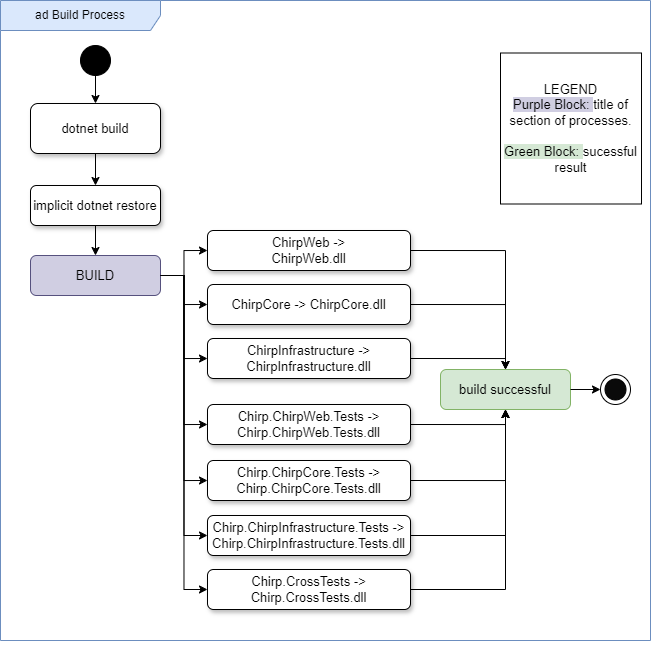
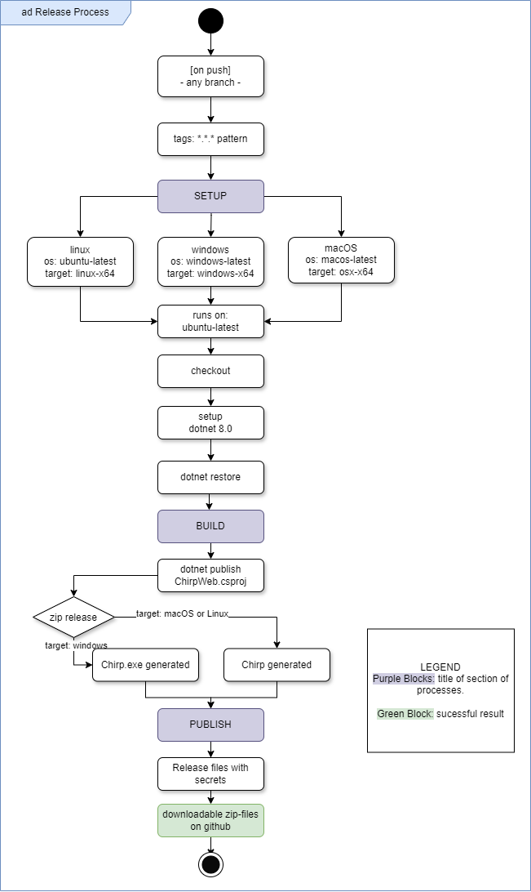

## Build, test, release, and deployment
### Build
Figure XXX below illustrates the build process. By running `dotnet build` in the terminal, an implicit run of `dotnet restore` is triggered. After restoring, .dll files are created for each .csproj file. When all .dll files are created, the terminal will output a `Build Successful!` message.

\pagebreak

### Test

Figure XXXX below details how our program is tested. After inputting `dotnet test` in the terminal from the source directory, `dotnet restore` will run. Hereafter, all test files will run, and the terminal will output `Success`/`Failure` states for each testing directory. Alternative methods to testing are described in the "How to run test suite locally" section.

\pagebreak

### Release

Figure XXXXX below is an illustration of our release process. A release can be triggered on push from any branch, but requires a tag that matches the pattern '*.*.*', e.g. 1.0.0.
Upon pushing a tag, the release workflow will activate and create three releases for each of the following operating systems: Windows, MacOS and Linux. Depending on whether the sub-release targets Windows or one of the other two operating systems, the executable file will be named Chirp.exe or Chirp respectively.
Our release is created from the `ChirpWeb.csproj` file, zipped and uploaded to GitHub where anyone can download them.

[MAYBE MENTION THAT RELEASE DOESN'T WORK]

\pagebreak

### Deployment

Figure XXXXXX shows how our program deploys from the GitHub workflow *Executable Release of Chirp*. The workflow is always triggered by a push to main, ensuring automatic deployment. For more control, we also have a workflow trigger on GitHub, where we can deploy from any branch.
This workflow takes care of building and publishing the project, as well as sending artifacts and secrets to the Azure host. When the workflow is finished, the website is updated.

\pagebreak

## How to run test suite locally

**Assuming the repository has been cloned:**

- Open a command line tool
- Navigate to the root directory (`/Chirp`) OR a specific test directory (e.g `/Chirp/test/Chirp.ChirpCore.Tests`)
- Enter `dotnet test` in the command line and press enter
- All tests will now run - If you're in a specific test directory, only tests for this directory run.

**Without cloning the repository:**

- Navigate to the GitHub website for the Chirp30 repository
- Press 'Actions' in the upper toolbar
- Choose workflow 'Build and Test .NET' in the list of workflows to the left
- Choose 'Run workflow' twice - let branch remain as 'main'
- Observe the workflow where each test directory has its own job, which states whether the tests have passed and failed.

In `Chirp.ChirpCore.Tests` we have unit tests for testing the ChirpCore part of the program, by creating entities of our domain model types and testing whether they can be created correctly, as well as test that Cheeps and Authors can be related to each other.
We have a test in `Chirp.ChirpInfrastructure.Tests` that is independent of the program code, and should ALWAYS pass - it is our canary in the coal mine[^CanaryFootnote]. If this test fails, our test suite is not functioning.
Up until the final few weeks we had API tests in `Chirp.ChirpWeb.Tests`, which tested if we got the expected outputs from both the public and private timelines. These tests became unusable and were removed when we changed our database to run using an environment variable.

## License
>The MIT License (MIT)
>
>Copyright (c) 2024 ITU-BDSA2024-GROUP30
>
>Permission is hereby granted, free of charge, to any person obtaining a copy of this software and associated documentation files (the "Software"), to deal in the Software without restriction, including without limitation the rights to use, copy, modify, merge, publish, distribute, sublicense, and/or sell copies of the Software, and to permit persons to whom the Software is furnished to do so, subject to the following conditions:
>
>The above copyright notice and this permission notice shall be included in all copies or substantial portions of the Software.
>
>THE SOFTWARE IS PROVIDED "AS IS", WITHOUT WARRANTY OF ANY KIND, EXPRESS OR IMPLIED, INCLUDING BUT NOT LIMITED TO THE WARRANTIES OF MERCHANTABILITY, FITNESS FOR A PARTICULAR PURPOSE AND NONINFRINGEMENT. IN NO EVENT SHALL THE AUTHORS OR COPYRIGHT HOLDERS BE LIABLE FOR ANY CLAIM, DAMAGES OR OTHER LIABILITY, WHETHER IN AN ACTION OF CONTRACT, TORT OR OTHERWISE, ARISING FROM, OUT OF OR IN CONNECTION WITH THE SOFTWARE OR THE USE OR OTHER DEALINGS IN THE SOFTWARE.
>>See our License.MD file in the root of our directory for the associated Microsoft licenses.

We have used packages from Microsoft in our program (.NET, EFCore), from which all fall under the MIT License. As the MIT License is GPL compatible[^UniOfPitts], it means we could have chosen a different Open Source license for our project[^LicenseCompat]. However this would have been more intricate, as the different license we would choose would still need to be compatible with the MIT license.
Therefore we too have decided to use the MIT license, such that all code in the program is under the same license.

[^UniOfPitts]:'University of Pittsburgh, "Course & Subject Guides: MIT License Compatibility"' <https://pitt.libguides.com/openlicensing/MIT#:~:text=MIT%20License%20Compatibility,project%20must%20of%20GPL%20compliant.>
[^LicenseCompat]:'Wikipedia: "License Compatibility: Compatibility of FOSS licenses"' <https://en.wikipedia.org/w/index.php?title=License_compatibility&section=3#Compatibility_of_FOSS_licenses>
[^CanaryFootnote]: A 'canary in the coal mine' refers to the practice of using canaries to alert miners of dangerous air quality. Thus, it is an indicator of *something* being wrong. <https://en.wiktionary.org/wiki/canary_in_a_coal_mine>
